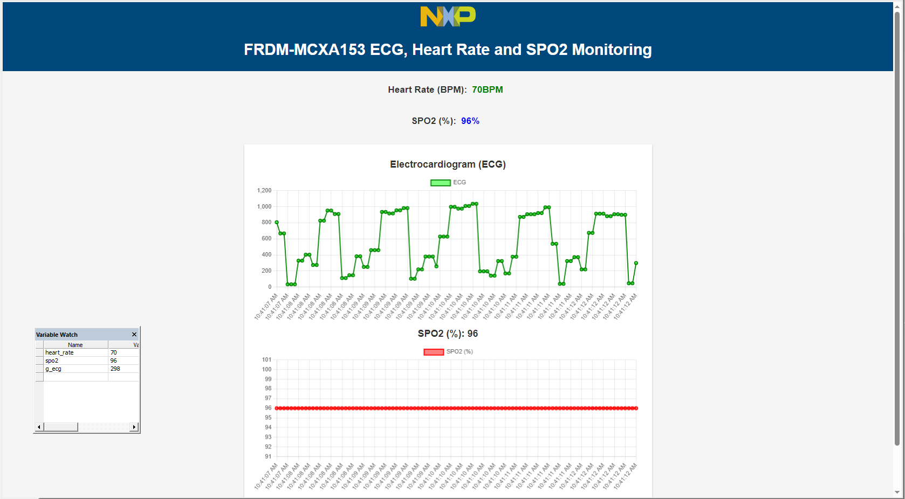
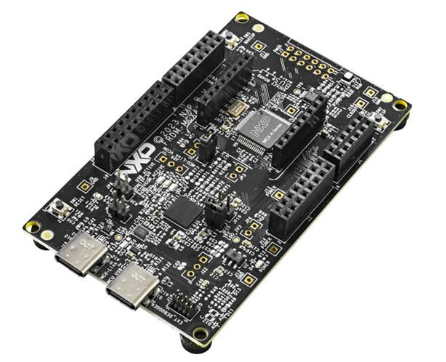
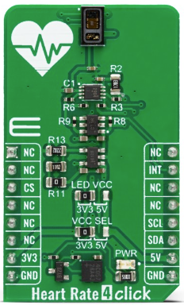
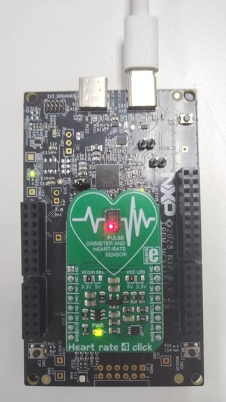
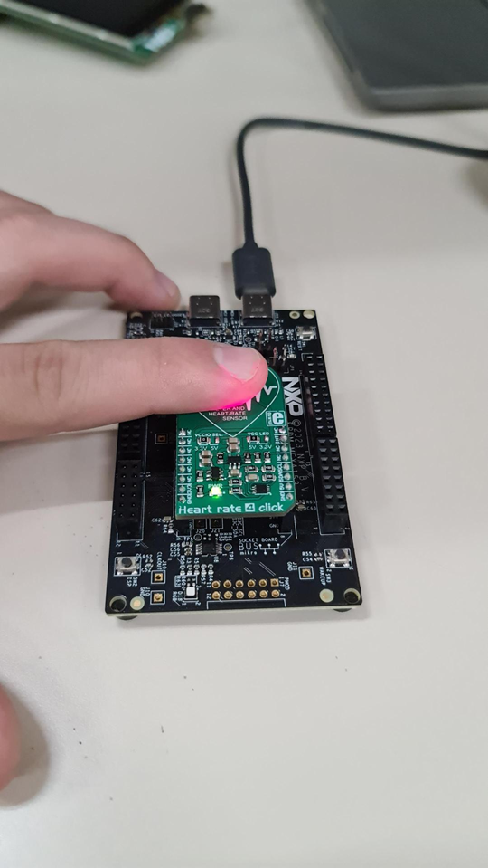

# NXP Application Code Hub

## frdm-mcxa153-freemaster-heart-rate
This demo mainly demonstrates how to use FRDM-MCXA153 to collect ecg, heart rate and blood oxygen saturation data, also uses FreeMASTER as the UI for display. The MCU (MCXA153) adjusts intensity of LED's in sensor for reads better values of light intensity data from MAX30101 via the I2C bus, performs filtering, other signal processing operations and algorithms to obtain the final result (ecg ,heart rate and SPO2 with waveforms), and saves it in the on-chip RAM. The on-board debugger of FRDM-MCXA153 reads the ecg, heart rate and blood oxygen data from the MCU via the SWD, and displays the results on the FreeMASTER web page. The UI of FreeMASTER uses JS script for web-based waveform display.

#### Boards: FRDM-MCXA153

#### Categories: Sensor
#### Peripherals: I2C
#### Toolchains: MDK, MCUXpresso IDE

## Table of Contents
1. [Software](#step1)
2. [Hardware](#step2)
3. [Setup](#step3)
4. [Results](#step4)
5. [FAQs](#step5) 
6. [Support](#step6)
7. [Release Notes](#step7)

## 1. Software
- Download and install [MCUXpresso IDE V11.9.0 or later](https://nxp.flexnetoperations.com/control/frse/download?agree=Accept&element=3595113).
- Download and install the latest version of [FreeMASTER](https://www.nxp.com/design/software/development-software/freemaster-run-time-debugging-tool:FREEMASTER)(3.2.2.2).
- MCUXpresso for Visual Studio Code: This example supports MCUXpresso for Visual Studio Code, for more information about how to use Visual Studio Code please refer [here](https://www.nxp.com/design/training/getting-started-with-mcuxpresso-for-visual-studio-code:TIP-GETTING-STARTED-WITH-MCUXPRESSO-FOR-VS-CODE).

## 2. Hardware
- FRDM-MCXA153   

- [HEART RATE 4 CLICK module](https://www.mikroe.com/heart-rate-4-click)(MIKROE-5547)  

- Personal Computer
- USB type-C cable

## 3. Setup
### Step 1 (Import Project)

1. Open MCUXpresso IDE, in the Quick Start Panel, choose **Import from Application Code Hub**    

	

2. Enter the demo name in the search bar.   

	

3. Click **Copy GitHub link**, MCUXpresso IDE will automatically retrieve project attributes, then click **Next>**.   

	

4. Select **main** branch and then click **Next>**, Select the MCUXpresso project, click **Finish** button to complete import.   

	

### Step 2 (Hardware Setup)

Connect FRDM-MCXA153 board with MIKROE HEART RATE 4 CLICK module via MIKEOE bus interface. Compile the project and use a TypeC-USB cable to connect to the FRDM board via MCU-LINK connector. Use MCU-LINK to download program into MCU.   

### Step 3 (Running The Demo)

Compile the project and download program into MCU. Press SW1 on FRDM board to reset the board. Open  FreeMASTER project "heart_rate.pmpx" in the code package.

## 4. Results
Place the middle finger on the light-emitting part of the MAX30101 sensor and try to move the finger as little as possible. After sensor calibration about 5-10 seconds, you should see changes in the ecg, heart rate and blood oxygen waveform on FreeMASTER, indicating that the demo is running successfully.

## 5. FAQs
No FAQs have been identified for this project.

## 6. Support
#### Project Metadata
<!----- Boards ----->

<!----- Categories ----->

<!----- Peripherals ----->

<!----- Toolchains ----->
 

Questions regarding the content/correctness of this example can be entered as Issues within this GitHub repository.

>**Warning**: For more general technical questions regarding NXP Microcontrollers and the difference in expected funcionality, enter your questions on the [NXP Community Forum](https://community.nxp.com/)

## 7. Release Notes
| Version | Description / Update                           | Date                        |
|:-------:|------------------------------------------------|----------------------------:|
| 1.0     | Initial release on Application Code Hub        | January 30th 2024 |

